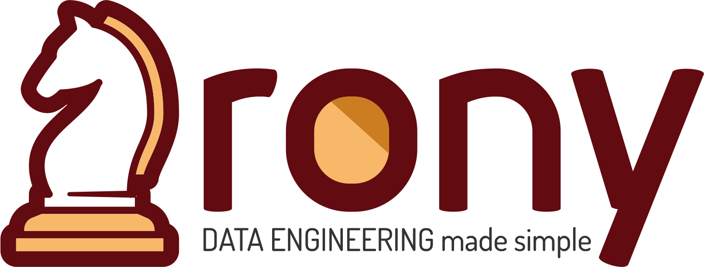

# Rony



An opinionated Data Engineering framework

Developed with ❤️ by <a href="http://www.a3data.com.br/" target="_blank">A3Data</a>

## What is Rony

Rony is an **open source** framework that helps Data Engineers setting up more organized code and build, test and deploy data pipelines faster.

## Why Rony?

Rony is <a href="https://github.com/A3Data/hermione" target="_blank">Hermione</a>'s *best friend* (or so...). 
This was a perfect choice for naming the second framework
released by A3Data, this one focusing on Data Engineering. 

In many years on helping companies building their data analytics projects and cloud infrastructure, we acquired 
a knowledge basis that led to a collection of code snippets and automation procedures that speed things up
when it comes to developing data structure and data pipelines.

## Some choices we made

Rony relies on top of a few decisions that make sense for the majority of projects conducted by A3Data:

- <a href="https://www.terraform.io/intro/index.html" target="_blank">Terraform (>= 0.13)</a>
- <a href="https://www.docker.com/" target="_blank">Docker</a>
- <a href="https://airflow.apache.org/" target="_blank">Apache Airflow</a>
- <a href="https://aws.amazon.com/" target="_blank">AWS</a>

You are free to change this decisions as you wish (that's the whole point of the framework - **flexibility**).


```{toctree}
:maxdepth: 2
:hidden:
:caption: Getting started

Installing
QuickStart
```

```{toctree}
:maxdepth: 2
:hidden:
:caption: Usage

CI
AWS
GCP

```

```{toctree}
:maxdepth: 2
:hidden:
:caption: Contributing

Contributing

```